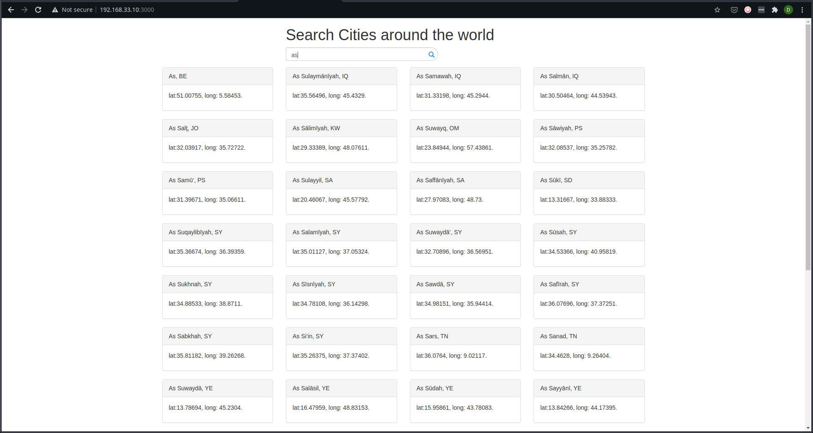

# Elasticsearch Search Engine

Simple POC application that uses elasticsearch to retrieve search results from a set of indexed data.

## Running this setup locally

The easiest way would be to use Vagrant. Change directory into the project directory and run `vagrant up`.
Doing so runs a CentOS-7 virtual machine and sets it up with nodejs and elasticsearch via the script
`bootstrap.sh`.
Once the setup completes, simply ssh into the virtual machine using `vagrant ssh`, run `cd /home/vagrant/app`
to change directory into the project directory, and run `npm run start`.

### Viewing the result

If you run the project as is, you may be able to view the webpages at http://192.168.33.10:3000/ and http://192.168.33.10:3000/v2.
If you've messed around with the code and/or Vagrantfile, you probably know how to view the result yourself.

## Screenshot

